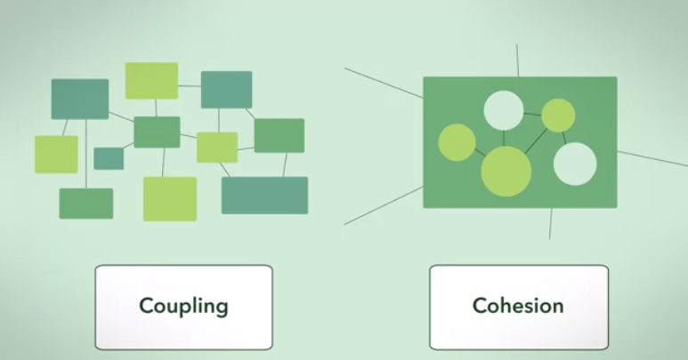

# Low-in coupling and High-in cohesion

Cohesion refers to the degree to which the elements of a module/class belong together, it is suggested that the related code should be close to each other, so we should strive for high cohesion and bind all related code together as close as possible. It has to do with the elements within the module/class.

Coupling refers to the degree to which the different modules/classes depend on each other, it is suggested that all modules should be independent as far as possible, that's why low coupling. It has to do with the elements among different modules/classes.

