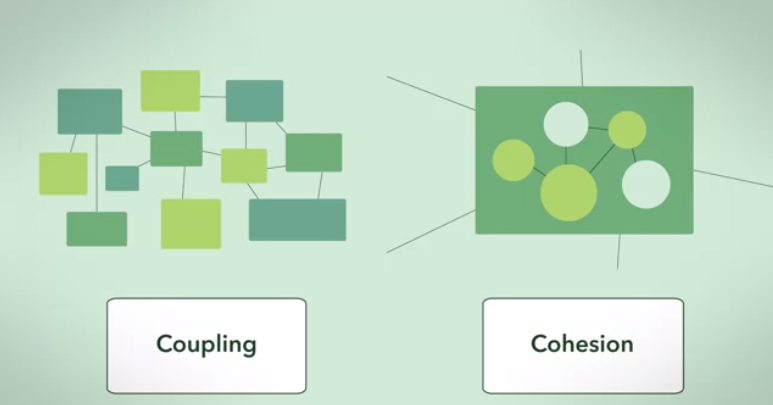

# Low coupling and high cohesion

Cohesion refers to the degree to which the elements of a module/class belong together, it is suggested that the related code should be close to each other, so we should strive for high cohesion and bind all related code together as close as possible. It has to do with the elements within the module/class.

Coupling refers to the degree to which the different modules/classes depend on each other, it is suggested that all modules should be independent as far as possible, that's why low coupling. It has to do with the elements among different modules/classes.

Code can be said to be decoupled when your components are designed in such a way that they don’t depend on the concrete implementations of others. Components are loosely coupled when dependencies between them are enforced by a type of code agreement or contract to make the communication lines between them as simple as possible.

Loose coupling refers to how much a component of code knows about the inner workings of another component of code. If it depends on knowing too much about a certain component, then it is considered highly coupled. When a component doesn’t know too much about the inner workings of other components it is considered loosely coupled.

High cohesion refers to a component that is very well defined. Meaning that it serves only one purpose and it accomplishes that purpose very well. If you have a component that reads from a database, sends an email, prints out documents, then it does not have high cohesion. Each one of those should be separated out into its own component. By having a component do only one thing you can gain many benefits, such as testing only what you need, separation of concerns, and ease of maintenance.

Creating one class instance inside another causes tight coupling and is not a good practice.
